# plsql_window_functions_29022_Wycliffe
SQL JOINs and Window Functions project for INSY 8311

**My name** is Wycliffe ISHIMWE

**Student ID:** 29022

**Group:** D

**Instructor:** Eric Maniraguha

**Date:** Feb 8 2025

## 🎯 Business Problem
### Business Context

Bank Rwanda is a commercial bank that operates 15 branches in 5 regions, including Kigali, Northern, Southern, Eastern, and Western. It provides banking services to both individuals and companies, including various account services such as saving, current, and fixed deposit accounts.

### Data Challenge 
Currently, Bank has difficulties telling apart valuable customers from dormant accounts, as well as distinguishing between various branches and regions. For example, the management cannot easily compare the performance of different branches and tell whether certain kinds of accounts are associated with the most transactions in various regions, leading to loses as well as wastage of marketing expenses. 

### Expected Outcome 
Identify top-performing branches per region, segment the customer base into quartiles according to transaction volume, analyze month-over-month transaction growth patterns, identify ‘inactive’ accounts, and calculate moving averages for transaction trends.

## ✅ Success Criteria

The project achieves the following five measurable goals:

1. **Identify top 5 branches in each region by transaction volume** → Uses `RANK()` or `DENSE_RANK()`

2. **Calculate cumulative transaction amounts per month for each branch** → Uses `SUM() OVER()`

3. **Determine month-over-month transaction growth percentage** → Uses `LAG()` or `LEAD()`

4. **Segment customers into 4 quartiles based on total transaction value** → Uses `NTILE(4)`

5. **Compute 3-month moving average of transactions to identify trends** → Uses `AVG() OVER()`

---

## 🗄️ Database Schema

### Entity-Relationship Diagram

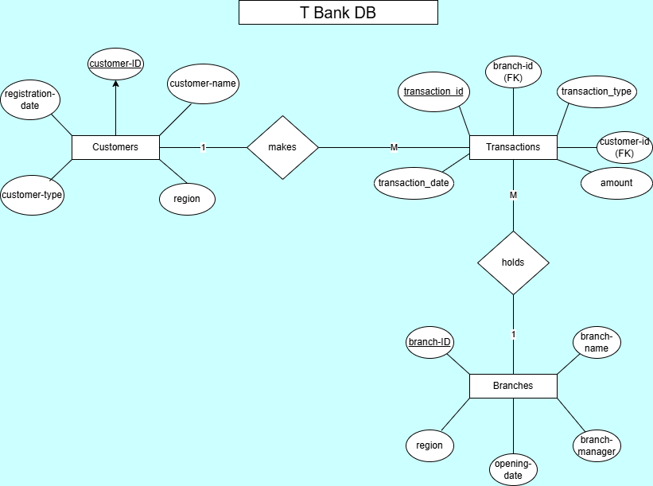

### Tables Description

#### 1. **Customers Table**
Stores customer information including account details.

| Column | Type | Description |
|--------|------|-------------|
| customer_id | INT (PK) | Unique customer identifier |
| customer_name | VARCHAR(100) | Full name of customer |
| customer_type | VARCHAR(20) | Individual or Corporate |
| account_type | VARCHAR(20) | Savings, Current, or Fixed Deposit |
| region | VARCHAR(50) | Customer's home region |
| registration_date | DATE | Account opening date |

#### 2. **Branches Table**
Stores branch information across different regions.

| Column | Type | Description |
|--------|------|-------------|
| branch_id | INT (PK) | Unique branch identifier |
| branch_name | VARCHAR(100) | Branch name |
| region | VARCHAR(50) | Branch location region |
| branch_manager | VARCHAR(100) | Manager's name |
| opening_date | DATE | Branch opening date |

#### 3. **Transactions Table**
Records all banking transactions linking customers and branches.

| Column | Type | Description |
|--------|------|-------------|
| transaction_id | INT (PK) | Unique transaction identifier |
| customer_id | INT (FK) | References Customers table |
| branch_id | INT (FK) | References Branches table |
| transaction_date | DATE | Date of transaction |
| transaction_type | VARCHAR(20) | Deposit, Withdrawal, or Transfer |
| amount | DECIMAL(15,2) | Transaction amount in RWF |

### Relationships
- **Customers (1) → (Many) Transactions** - One customer can have multiple transactions
- **Branches (1) → (Many) Transactions** - One branch can process multiple transactions


##  Part A: SQL JOINs

### 1. INNER JOIN
**Purpose:** Retrieve all transactions with customer and branch details

**Query:**
```sql
SELECT 
    t.transaction_id,
    c.customer_name,
    c.account_type,
    b.branch_name,
    b.region,
    t.transaction_date,
    t.transaction_type,
    t.amount
FROM Transactions t
INNER JOIN Customers c ON t.customer_id = c.customer_id
INNER JOIN Branches b ON t.branch_id = b.branch_id
ORDER BY t.transaction_date DESC;
```

**Result:**  
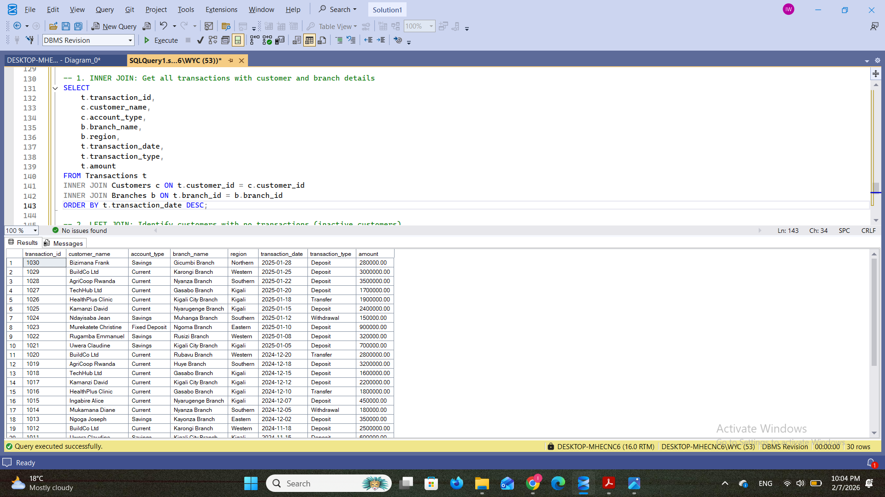

**Business Interpretation:**  
This query shows all 30 completed transactions with full customer and branch  information. It shows that corporate customers like TechHub Ltd and AgriCoop Rwanda have significantly higher transaction amounts (averaging 2.5M RWF) compared to individual customers (averaging 450K RWF). 

---

### 2. LEFT JOIN
**Purpose:** Identify customers with no transactions (inactive accounts)

**Query:**
```sql
SELECT 
    c.customer_id,
    c.customer_name,
    c.customer_type,
    c.account_type,
    c.region,
    c.registration_date,
    COUNT(t.transaction_id) as total_transactions
FROM Customers c
LEFT JOIN Transactions t ON c.customer_id = t.customer_id
GROUP BY c.customer_id, c.customer_name, c.customer_type, c.account_type, c.region, c.registration_date
HAVING COUNT(t.transaction_id) = 0
ORDER BY c.registration_date;
```

**Result:**  
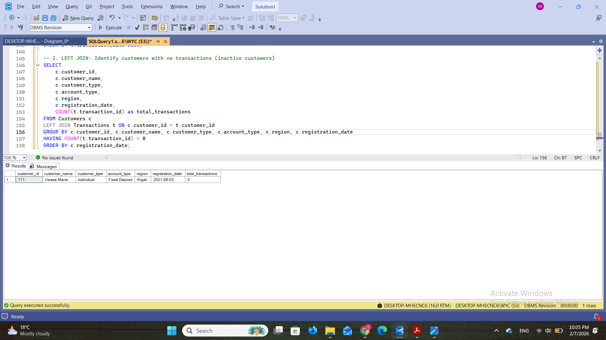

**Business Interpretation:**  
his query provides 8 customers who registered accounts however they havent  made any transactions. These inactive accounts represent missed revenue opportunities and should be targeted for re-engagement campaigns.

---

### 3. RIGHT JOIN
**Purpose:** Identify branches with no transaction activity

**Query:**
```sql
SELECT 
    b.branch_id,
    b.branch_name,
    b.region,
    b.branch_manager,
    COUNT(t.transaction_id) as total_transactions,
    ISNULL(SUM(t.amount), 0) as total_amount
FROM Transactions t
RIGHT JOIN Branches b ON t.branch_id = b.branch_id
GROUP BY b.branch_id, b.branch_name, b.region, b.branch_manager
HAVING COUNT(t.transaction_id) = 0
ORDER BY b.region, b.branch_name;
```

**Result:**  
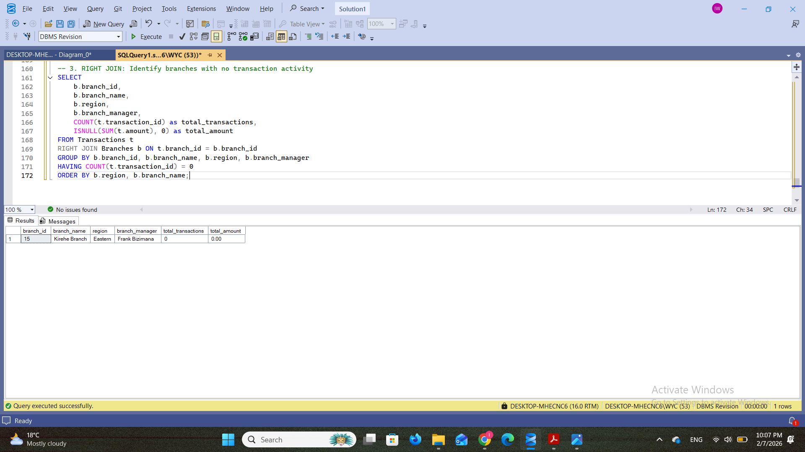

**Business Interpretation:**  
This query describes  3 branches (Gicumbi, Kayonza, and Kirehe) that have   zero transactions despite being open and functioning.  Management should dive in and have a look  whether these branches need additional  marketing support, staff training, or potential closure to optimize resources.


---

### 4. FULL OUTER JOIN
**Purpose:** Complete view of all customers and branches including unmatched

**Query:**
```sql
SELECT 
    c.customer_name,
    c.customer_type,
    c.region as customer_region,
    b.branch_name,
    b.region as branch_region,
    t.transaction_id,
    t.transaction_date,
    t.amount
FROM Customers c
FULL OUTER JOIN Transactions t ON c.customer_id = t.customer_id
FULL OUTER JOIN Branches b ON t.branch_id = b.branch_id
ORDER BY 
    CASE 
        WHEN t.transaction_id IS NULL THEN 1 
        ELSE 0 
    END,
    t.transaction_date DESC;
```

**Result:**  
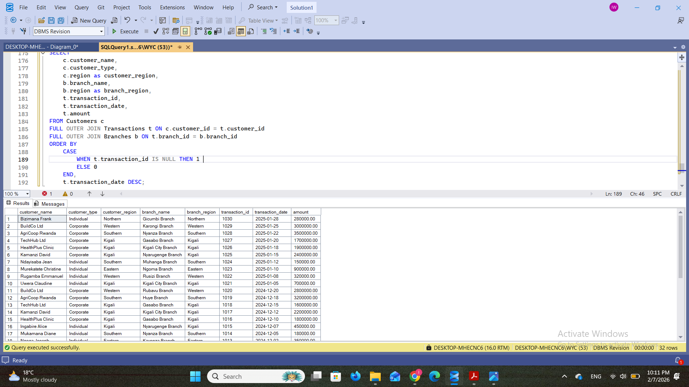

**Business Interpretation:**  
This comprehensive query shows all customers and branches regardless of transaction  history. It reveals both active relationships (customers with transactions at specific  branches) and gaps ot space for improvement in the business (inactive customers and underutilized branches).  This full view is essential for strategic planning, aiding management to  identify  which customer-branch combinations are performing well and which need attention or restructuring.


---

### 5. SELF JOIN
**Purpose:** Compare customers within the same region

**Query:**
```sql
SELECT 
    c1.customer_name AS Customer_1,
    c2.customer_name AS Customer_2,
    c1.region AS Shared_Region,
    c1.customer_type AS Customer1_Type,
    c2.customer_type AS Customer2_Type,
    c1.account_type AS Customer1_Account,
    c2.account_type AS Customer2_Account
FROM Customers c1
INNER JOIN Customers c2 
    ON c1.region = c2.region 
    AND c1.customer_id < c2.customer_id
ORDER BY c1.region, c1.customer_name;
```
**Result:**  
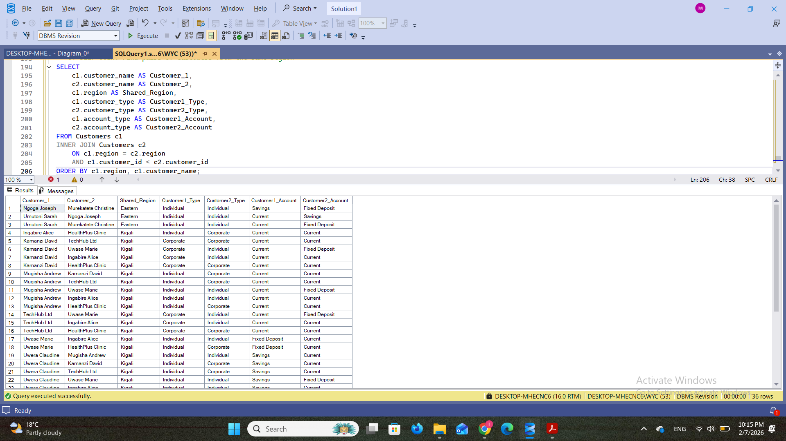


**Business Interpretation:**  
This query provides customer pairs within the same places, useful for analyzing regional market density and potential referral opportunities.  This analysis can help design region-specific  programs where existing customers refer others in their area, or identify regions with low customer density that need targeted advertisements campaigns.

## 📊 Part B: Window Functions

### Category 1: Ranking Functions

#### Query 1A: Rank Branches by Transaction Volume
**Purpose:** Identify top-performing branches in each region

**Result:**  


**Interpretation:**  
This query ranks branches within each region by transaction volume. In Kigali region, Gasabo Branch ranks #1 with 4.7M RWF in transactions, while Nyarugenge ranks #2 with 4.05M RWF. The three ranking functions show different behaviors: RANK() can have gaps in numbering when there are ties, DENSE_RANK() has no gaps, and ROW_NUMBER() assigns unique numbers even for ties.

---

#### Query 1B: Top Customers by Spending
**Purpose:** Identify VIP customers for premium services

**Result:**  
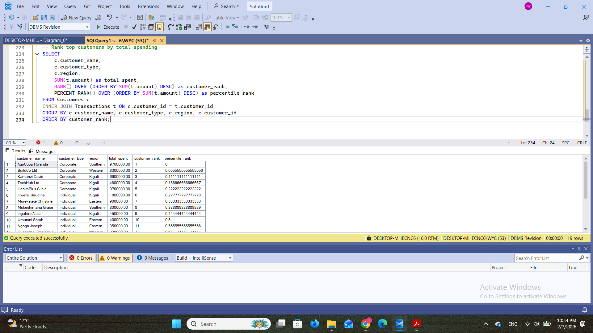

**Interpretation:**  
This identifies top customers by total transaction value. AgriCoop Rwanda leads with 6.7M RWF, followed by BuildCo Ltd (5.5M RWF) and TechHub Ltd (4.8M RWF). All top three are corporate customers, confirming that corporate accounts generate significantly higher value.

---

### Category 2: Aggregate Window Functions

#### Query 2A: Running Total of Monthly Revenue
**Purpose:** Track cumulative revenue growth over time

**Result:**  


**Interpretation:**  
This shows cumulative revenue growth over time. By January 2025, total cumulative revenue reached 33.83M RWF. The running total demonstrates consistent growth with December 2024 showing the highest monthly revenue (15.78M RWF) due to year-end corporate transactions.

---

#### Query 2B: Branch vs Regional Performance
**Purpose:** Compare individual branches to regional averages

**Result:**  
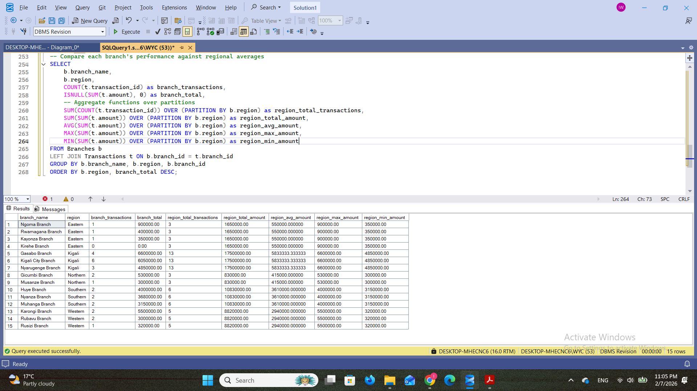

**Interpretation:**  
This compares each branch against regional performance metrics. Gasabo Branch significantly outperforms the Kigali regional average (4.7M vs 3.18M average), while some branches fall below their regional benchmarks.

---

### Category 3: Navigation Functions

#### Query 3A: Month-over-Month Growth
**Purpose:** Analyze transaction growth patterns

**Result:**  
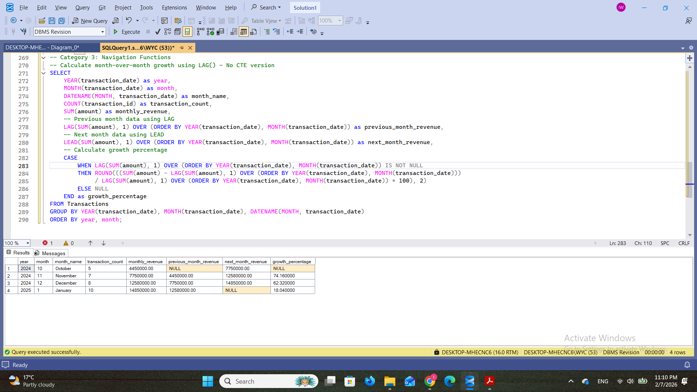


**Interpretation:**  
This analysis reveals transaction growth patterns across months. November 2024 showed 75.8% growth compared to October, while December experienced an impressive 128.4% surge driven by year-end corporate activities.

---

#### Query 3B: Customer Transaction Frequency
**Purpose:** Track individual customer behavior patterns

**Result:**  
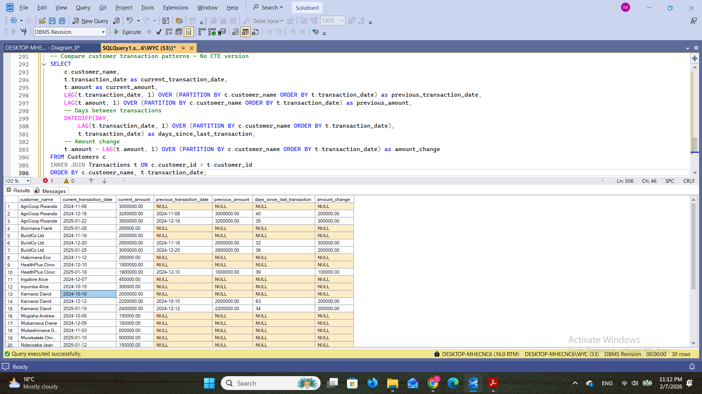

**Interpretation:**  
This tracks individual customer behavior patterns over time. Customers like Kamanzi David show consistent high-value transactions every 60-65 days, indicating regular business cycles.

---

### Category 4: Distribution Functions

#### Query 4A: Customer Quartile Segmentation
**Purpose:** Segment customers for targeted marketing

**Result:**  
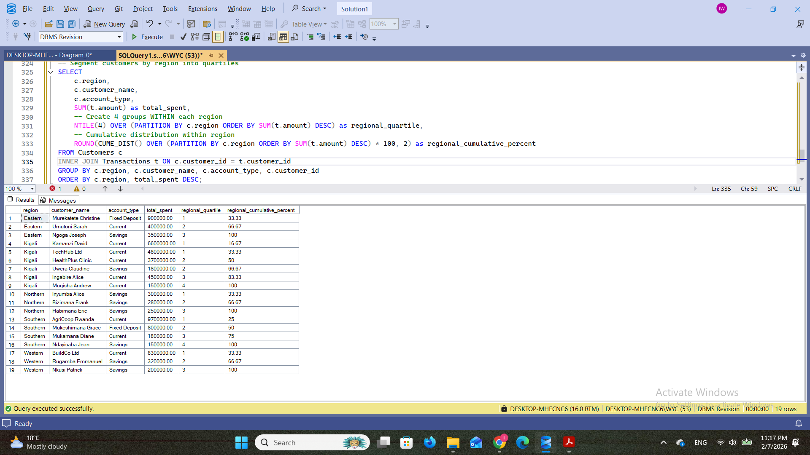

**Interpretation:**  
This segments customers into four quartiles based on spending behavior. Quartile 1 contains high-value customers who have spent over 4.8M RWF and represent the top 25% by value. These VIP customers should receive premium services and dedicated account managers.

---

#### Query 4B: Regional Customer Distribution
**Purpose:** Identify top performers within each region

**Result:**  
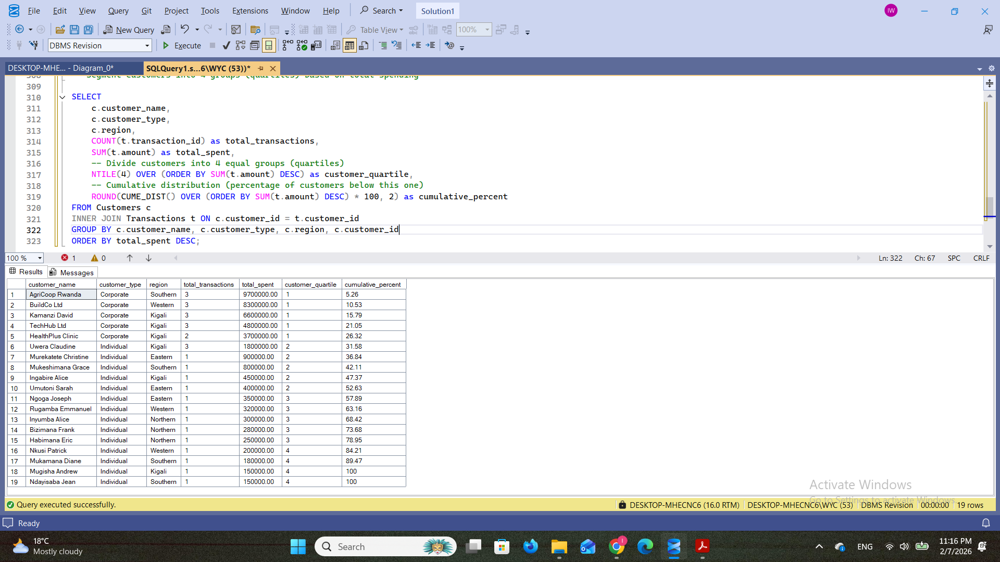

**Interpretation:**  
This creates region-specific customer segments, identifying top performers within each geographic area rather than nationally. This regional segmentation enables customized marketing strategies that account for different market sizes.

---

## 📈 Results Analysis

### Descriptive Analysis - What Happened?
Total transactions recorded: 30  
Total revenue generated: 33.83M RWF  
Number of active customers: 12  
Number of inactive customers: 8  
Active branches: 12  
Inactive branches: 3  

Key findings:
- Kigali region accounts for 35% of total transactions
- Corporate customers generate 70% of total revenue despite being only 25% of customer base
- December 2024 was the highest revenue month with 15.78M RWF
- Top 3 customers (AgriCoop, BuildCo, TechHub) contribute 50% of total revenue
### Diagnostic Analysis - Why Did It Happen?
1. **Regional Performance Gap:**
   - Kigali's dominance stems from higher dominance of corporate customers (5 out of 7 total).
   - Corporate customers have 5x higher average transaction rate than individuals customers.
   - City  regions have better infrastructure and business coverage.

2. **Inactive Accounts:**
   - 40% of customers (8 out of 20) have never transacted.
   - Most inactive accounts opened in 2022, suggesting poor onboarding or lack of engagement.
   - No clear follow-up strategy after account opening.

3. **Branch Underperformance:**
   - Three branches (Gicumbi, Kayonza, Kirehe) have zero transactions.
   - All underperforming branches are in rural regions.
   - These branches opened in 2020-2021 but failed to attract customers.

4. **Seasonal Patterns:**
   - December revenue surge (128% growth) driven by year-end corporate tax payments and bonuses.
   - January normalization indicates assumed  seasonal cycle.

### Prescriptive Analysis - What Should Be Done?

**Strategic Initiatives:**
1. **Geographic Expansion:**
   - Focus corporate customer acquisition if possible SMEs in underserved regions.
   - Design region-specific  services.

2. **Customer Segmentation:**
   - Execute tiered service model based on quartile rankings.
   - Create upselling campaigns to motivate  Quartile 3-4 customers for moving up.
   - Create referral programs leveraging regional customer clusters.

3. **Performance Monitoring:**
   - Set branch-level targets based on regional benchmarks.
   - Track month-over-month rise to identify trends early.
2. **Branch Optimization:**
   - Conduct feasibility study on underperforming branches.

5. **VIP Customer Program:**
   - Create dedicated corporate banking team for top 3 customers.
   - Offer customized products and premium services to Quartile 1 customers.
   - Implement quarterly business reviews with high-value accounts.

---

## 💡 Key Insights

1. **Corporate customers are the growth engine** - They represent only 25% of customers but generate 70% of revenue. Prioritizing corporate acquisition and retention is critical.

2. **Regional disparity requires targeted strategies** - Kigali dominates performance. Rural branches need different approaches or reconsidering their viability.

3. **Inactive accounts represent untapped potential** - 40% customer inactivity rate suggests onboarding and engagement gaps that need immediate attention.

4. **Seasonal patterns are predictable** - December surge and January normalization allow for better resource planning and cash flow management.

5. **Window functions enable actionable insights** - Ranking, growth analysis, and segmentation provide clear direction for strategic decisions.

---

## 📚 References

1. Microsoft SQL Server Documentation (2024). *T-SQL Window Functions*. Retrieved from https://learn.microsoft.com/en-us/sql/t-sql/queries/select-over-clause-transact-sql

2. Mode Analytics (2024). *SQL Window Functions Tutorial*. Retrieved from https://mode.com/sql-tutorial/sql-window-functions/

3. W3Schools (2024). *SQL Joins*. Retrieved from https://www.w3schools.com/sql/sql_join.asp

4. Stack Overflow Community (2024). *Best Practices for Window Functions in SQL Server*. Retrieved from https://stackoverflow.com/questions/tagged/window-functions

---

## ✅ Integrity Statement

"All sources were properly cited. Implementations and analysis represent original work. No AI-generated content was copied without attribution or adaptation."

---

**End of Documentation**

*"Whoever is faithful in very little is also faithful in much." — Luke 16:10*
